# VoteSphere Security Architecture

**Version:** 1.0  
**Last Updated:** February 6, 2026  
**Purpose:** Comprehensive security documentation for the VoteSphere secure college election system

---

## Table of Contents

1. [System Overview](#1-system-overview)
2. [Authentication System](#2-authentication-system)
3. [Encryption System](#3-encryption-system)
4. [Hash Chain Integrity](#4-hash-chain-integrity)
5. [Admin Security & Permissions](#5-admin-security--permissions)
6. [Email Security](#6-email-security)
7. [Data Flow Architecture](#7-data-flow-architecture)
8. [Threat Model & Mitigations](#8-threat-model--mitigations)
9. [Security Checklist](#9-security-checklist)
10. [Deployment Security](#10-deployment-security)

---

## 1. System Overview

### Architecture Principles

VoteSphere implements a **zero-trust, privacy-first architecture** for secure digital voting:

- **No voter identity storage** - Email addresses are hashed and deleted immediately
- **End-to-end encryption** - All votes encrypted with RSA-2048
- **Blockchain-style integrity** - SHA-256 hash chain prevents tampering
- **One-time authentication** - OTP-based email verification, no passwords
- **Immutable elections** - Elections cannot be modified once voting begins

### Security Layers

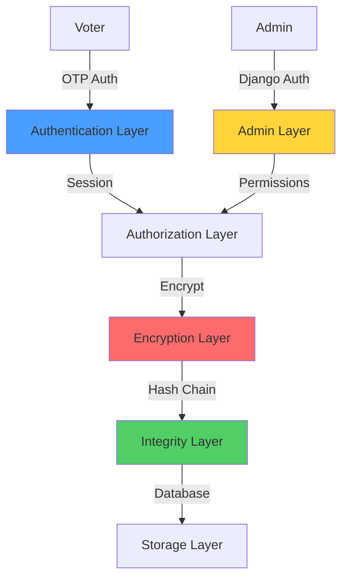

---

## 2. Authentication System

### OTP-Based Authentication Flow

VoteSphere uses a **passwordless, OTP-based authentication** system to ensure security without password management overhead.

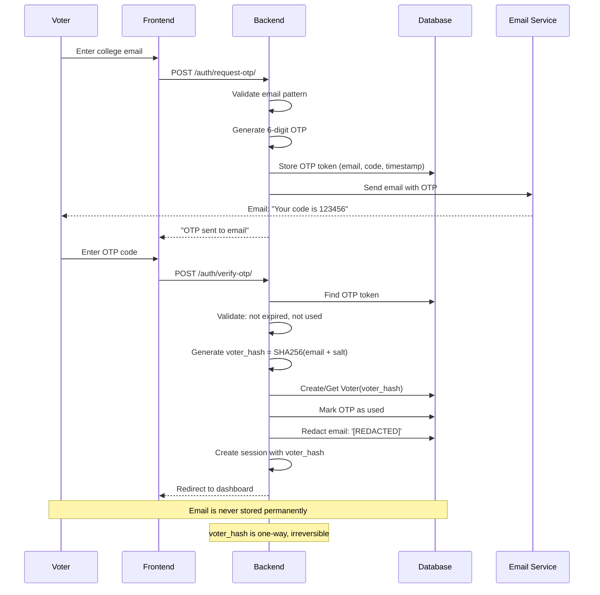

### Key Security Features

#### Email Privacy
```python
# After successful OTP verification
otp_token.email = '[REDACTED]'  # Original email destroyed
otp_token.save()

# Voter stored only as hash
voter_hash = SHA256(email + secret_salt)  # One-way function
```

#### OTP Security
- **Expiration:** 5 minutes (configurable)
- **Single-use:** Token marked invalid after verification
- **Rate limiting:** Should be implemented in production
- **Secure generation:** cryptographically random 6-digit code

#### Session Management
```python
# Session contains only the hash
request.session['voter_hash'] = voter_hash  # No PII

# Session expires on browser close (default Django)
# Can be extended with SESSION_COOKIE_AGE
```

---

## 3. Encryption System

### RSA Key Management Architecture

VoteSphere uses **RSA-2048** encryption for all vote data. Keys are managed separately for maximum security.

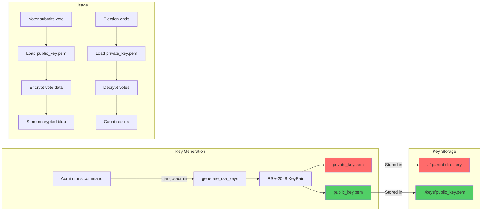

### Encryption Workflow

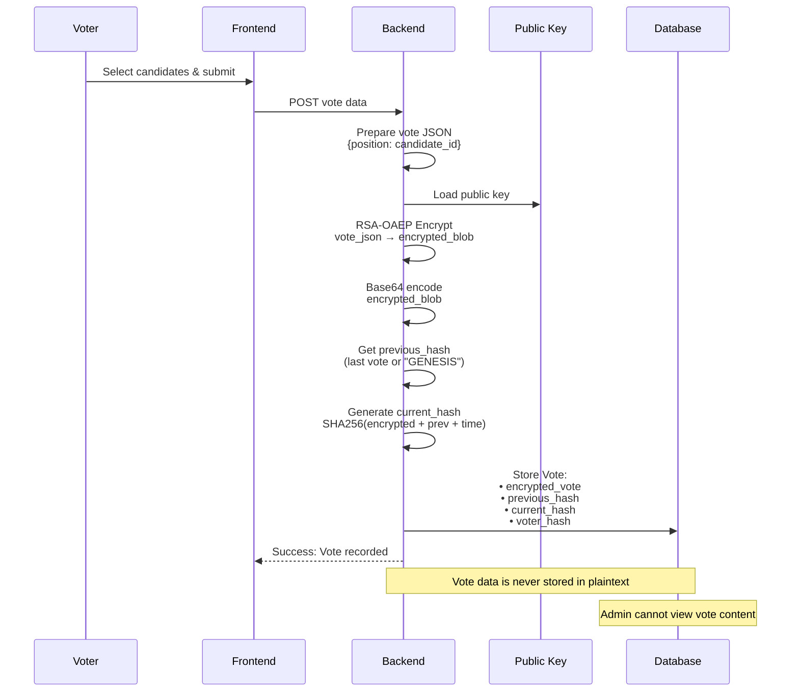

### Decryption Workflow (Results Phase)

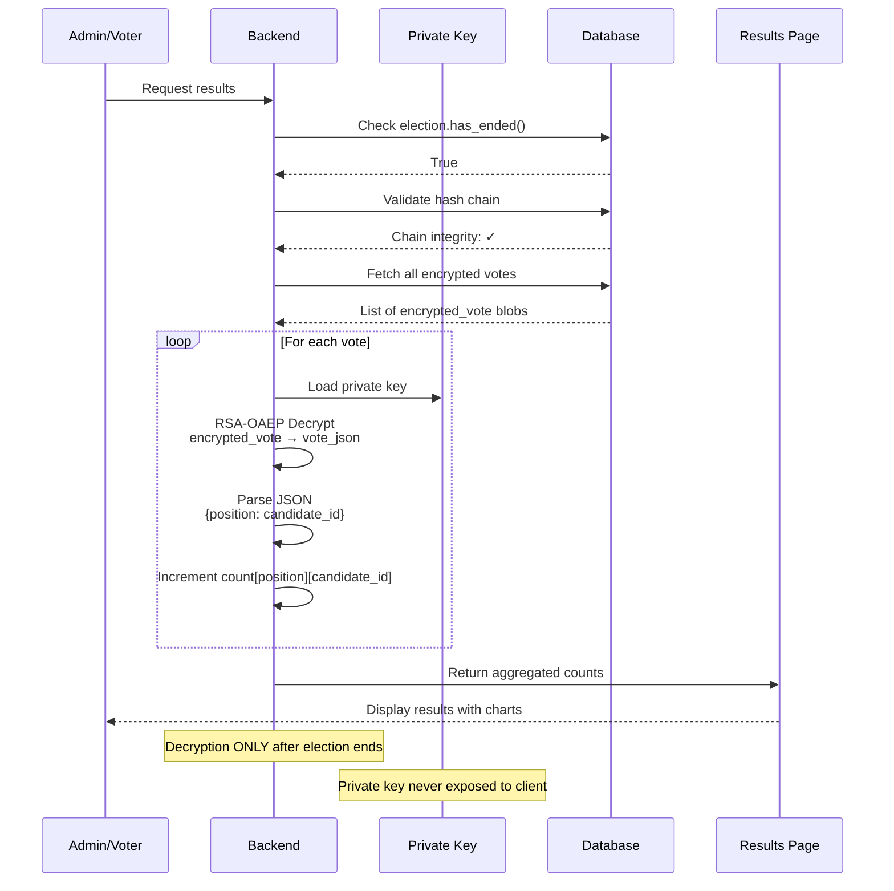

### Encryption Implementation Details

```python
# Vote Encryption (crypto_utils.py)
def encrypt_vote(vote_data: dict) -> str:
    # Convert to JSON
    vote_json = json.dumps(vote_data, sort_keys=True)
    
    # Load RSA public key
    public_key = load_public_key()
    
    # Encrypt with RSA-OAEP padding
    encrypted_bytes = public_key.encrypt(
        vote_json.encode('utf-8'),
        padding.OAEP(
            mgf=padding.MGF1(algorithm=hashes.SHA256()),
            algorithm=hashes.SHA256(),
            label=None
        )
    )
    
    # Return base64-encoded string
    return base64.b64encode(encrypted_bytes).decode('utf-8')
```

**Key Security Properties:**
- **RSA-OAEP:** Optimal Asymmetric Encryption Padding prevents chosen-ciphertext attacks
- **SHA256 MGF:** Mask Generation Function for padding
- **No homomorphic operations:** Cannot tally without decryption
- **Public key distribution:** Safe, only private key is sensitive

---

## 4. Hash Chain Integrity

### Blockchain-Style Vote Chain

VoteSphere implements a **blockchain-inspired hash chain** to ensure vote integrity and detect tampering.

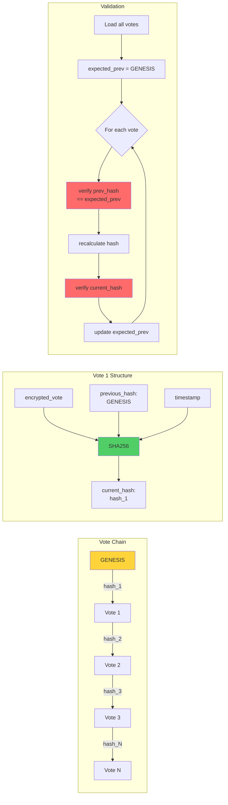

### Hash Generation Algorithm

```python
def generate_vote_hash(encrypted_vote: str, previous_hash: str, timestamp: datetime) -> str:
    """
    Generate SHA-256 hash for vote in the hash chain.
    """
    # Combine all components
    timestamp_str = timestamp.isoformat()
    data = f"{encrypted_vote}{previous_hash}{timestamp_str}".encode('utf-8')
    
    # Generate SHA-256 hash (64 hex characters)
    hash_obj = hashlib.sha256(data)
    return hash_obj.hexdigest()
```

### Validation Process

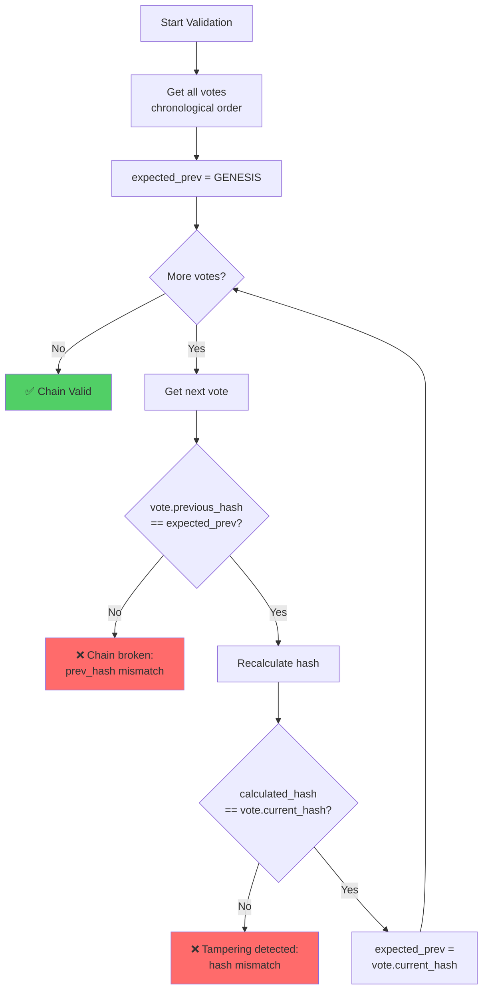

### Security Guarantees

1. **Tamper Detection:** Any modification to vote data changes `current_hash`, breaking the chain
2. **Order Integrity:** Votes cannot be reordered without breaking `previous_hash` links
3. **Insertion Prevention:** Cannot insert votes without recalculating entire chain
4. **Deletion Detection:** Missing votes break the chain sequence

---

## 5. Admin Security & Permissions

### Permission Matrix by Election State

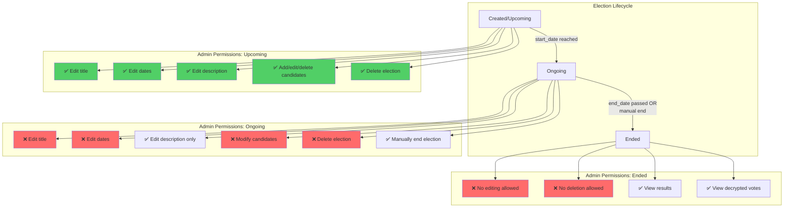

### Permission Enforcement (Django Admin)

```python
# admin.py - ElectionAdmin
def has_delete_permission(self, request, obj=None):
    """Prevent deletion of elections that have started or ended"""
    if obj and (obj.is_ongoing() or obj.has_ended()):
        return False
    return super().has_delete_permission(request, obj)

def has_change_permission(self, request, obj=None):
    """Prevent editing of elections that have ended"""
    if obj and obj.has_ended():
        return False
    return super().has_change_permission(request, obj)

def get_readonly_fields(self, request, obj=None):
    """Make critical fields read-only for ongoing elections"""
    if obj and obj.is_ongoing():
        return ['title', 'start_date', 'end_date']
    return []
```

### Vote Model Security

**Critical:** The `Vote` model is NOT registered in Django admin.

```python
# admin.py
# ============= SECURITY: Vote Model NOT Registered =============
# The Vote model is intentionally NOT registered in admin to prevent tampering.
# Votes are encrypted and protected by hash chain integrity.
# No admin interface is provided for viewing or modifying votes.
```

**Rationale:**
- Prevents admins from accessing encrypted vote data
- Prevents accidental or malicious vote deletion
- Prevents hash chain manipulation
- Results only accessible after election ends via decryption

---

## 6. Email Security

### Postmark Integration Flow

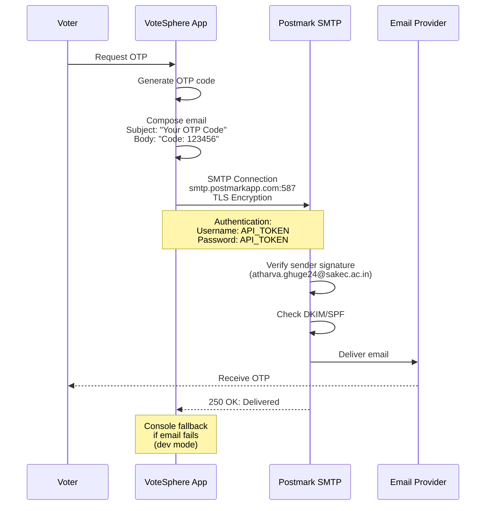

### Email Configuration

```python
# settings.py
EMAIL_BACKEND = 'django.core.mail.backends.smtp.EmailBackend'
EMAIL_HOST = 'smtp.postmarkapp.com'  # Transactional stream
EMAIL_PORT = 587
EMAIL_USE_TLS = True
EMAIL_HOST_USER = POSTMARK_API_TOKEN
EMAIL_HOST_PASSWORD = POSTMARK_API_TOKEN
DEFAULT_FROM_EMAIL = 'VoteSphere <atharva.ghuge24@sakec.ac.in>'
```

**Security Features:**
- **TLS Encryption:** All SMTP traffic encrypted in transit
- **Sender Verification:** Postmark requires verified sender signatures
- **API Token Auth:** No password storage, token-based authentication
- **Test Mode:** Sandbox mode available for testing
- **Activity Tracking:** Postmark logs all email activity

### Email Content Security

```python
# OTP Email Template (views.py)
send_mail(
    subject='VoteSphere - Your OTP Code',
    message=f'''
Your OTP code is: {otp_code}

This code will expire in {settings.OTP_EXPIRATION_MINUTES} minutes.

If you did not request this code, please ignore this email.
''',
    from_email=settings.DEFAULT_FROM_EMAIL,
    recipient_list=[email],
    fail_silently=False,
)
```

**Best Practices:**
- Clear expiration time
- No HTML content (prevents phishing vectors)
- Plain text only
- No clickable links (prevents spoofing)
- Sender verification instructions for security-conscious users

---

## 7. Data Flow Architecture

### Complete System Data Flow

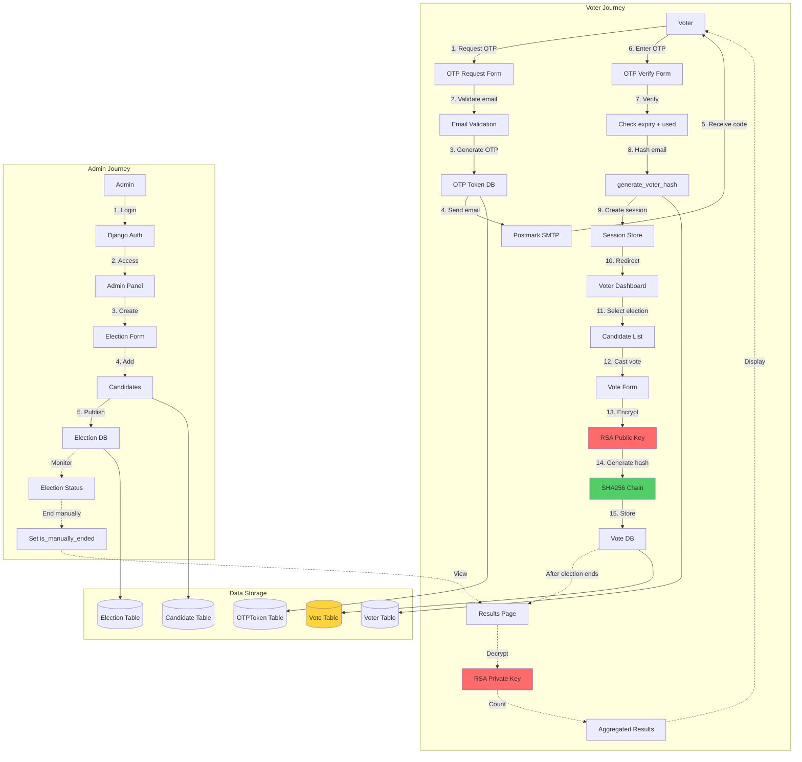

### Database Schema Relationships

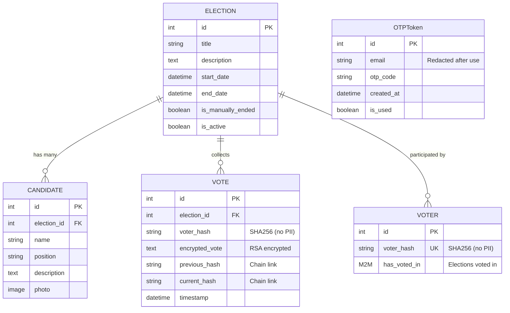

---

## 8. Threat Model & Mitigations

### Attack Vectors & Defenses

| Threat | Attack Vector | Mitigation | Status |
|--------|--------------|------------|--------|
| **Voter Identity Exposure** | Admin queries database for voter records | Emails hashed with secret salt, originals deleted | ✅ Implemented |
| **Vote Content Exposure** | Admin views encrypted_vote field | RSA-2048 encryption, private key stored securely | ✅ Implemented |
| **Vote Tampering** | Admin modifies vote record in DB | Hash chain validation detects changes | ✅ Implemented |
| **Vote Insertion** | Admin injects fake votes | Hash chain prevents insertion without detection | ✅ Implemented |
| **Election Manipulation** | Admin changes dates/candidates mid-election | Permission system prevents editing ongoing elections | ✅ Implemented |
| **Double Voting** | Voter votes multiple times | ManyToMany tracking prevents re-voting | ✅ Implemented |
| **OTP Interception** | Attacker intercepts email | TLS encryption, short expiry (5min), single-use | ✅ Implemented |
| **OTP Brute Force** | Attacker guesses OTP codes | Should implement rate limiting | ⚠️ **TODO** |
| **Session Hijacking** | Attacker steals session cookie | Django CSRF protection, secure cookies | ✅ Implemented |
| **Private Key Theft** | Attacker accesses server filesystem | Private key stored outside project, file permissions | ⚠️ Manual setup |
| **Result Manipulation** | Admin shows false results | Results calculated from decrypted votes only | ✅ Implemented |
| **Denial of Service** | Mass requests flood system | Should implement rate limiting | ⚠️ **TODO** |

### Security Assumptions

**Trust Boundaries:**
- **Trusted:** Server filesystem, database server, Django framework
- **Untrusted:** All user input (voters & admins), network traffic
- **Semi-trusted:** Email service provider (Postmark)

**Cryptographic Assumptions:**
- RSA-2048 is computationally infeasible to break
- SHA-256 is collision-resistant
- Python's `random` module is sufficiently random for OTPs (use `secrets` for production)

### Recommended Improvements

1. **Rate Limiting:**
   ```python
   # Install: django-ratelimit
   @ratelimit(key='ip', rate='5/m', method='POST')
   def request_otp(request):
       # Limit 5 OTP requests per minute per IP
   ```

2. **OTP Generation:**
   ```python
   import secrets
   otp_code = str(secrets.randbelow(1000000)).zfill(6)
   # Cryptographically secure random
   ```

3. **HTTPS Enforcement:**
   ```python
   # settings.py (production)
   SECURE_SSL_REDIRECT = True
   SESSION_COOKIE_SECURE = True
   CSRF_COOKIE_SECURE = True
   SECURE_HSTS_SECONDS = 31536000
   ```

4. **Private Key Encryption:**
   ```python
   # Encrypt private key with passphrase
   private_pem = private_key.private_bytes(
       encryption_algorithm=serialization.BestAvailableEncryption(b'passphrase')
   )
   ```

---

## 9. Security Checklist

### Pre-Production Checklist

- [ ] **Environment Variables**
  - [ ] Move `SECRET_KEY` to environment variable
  - [ ] Move `POSTMARK_API_TOKEN` to environment variable
  - [ ] Move `VOTER_SALT` to environment variable
  - [ ] Set `DEBUG = False`
  - [ ] Configure `ALLOWED_HOSTS`

- [ ] **Cryptography**
  - [ ] Generate RSA keys with `python manage.py generate_rsa_keys`
  - [ ] Verify private key is NOT in project directory
  - [ ] Verify private key has restrictive permissions (0600)
  - [ ] Consider encrypting private key with passphrase
  - [ ] Backup private key securely (encrypted backup)

- [ ] **Email**
  - [ ] Verify sender signature in Postmark
  - [ ] Test OTP delivery to various providers
  - [ ] Configure SPF/DKIM records (if using custom domain)
  - [ ] Set up email activity monitoring

- [ ] **Database**
  - [ ] Use PostgreSQL or MySQL (not SQLite) for production
  - [ ] Enable database backups
  - [ ] Restrict database access (firewall rules)
  - [ ] Use separate database user with minimal permissions

- [ ] **Web Server**
  - [ ] Enable HTTPS with valid SSL certificate
  - [ ] Configure HSTS headers
  - [ ] Set up CSRF protection
  - [ ] Configure secure cookie flags
  - [ ] Implement rate limiting (nginx/cloudflare)

- [ ] **Monitoring**
  - [ ] Set up error logging (Sentry, etc.)
  - [ ] Monitor hash chain validation failures
  - [ ] Monitor failed login attempts
  - [ ] Set up uptime monitoring

- [ ] **Testing**
  - [ ] Test complete voting flow end-to-end
  - [ ] Test hash chain with multiple votes
  - [ ] Test admin permission restrictions
  - [ ] Test OTP expiration and reuse prevention
  - [ ] Penetration testing (recommended)

---

## 10. Deployment Security

### Production Configuration Example

```python
# settings.py (production)
import os
from pathlib import Path

# Security
SECRET_KEY = os.environ['DJANGO_SECRET_KEY']
DEBUG = False
ALLOWED_HOSTS = ['votesphere.college.edu', 'www.votesphere.college.edu']

# HTTPS
SECURE_SSL_REDIRECT = True
SESSION_COOKIE_SECURE = True
CSRF_COOKIE_SECURE = True
SECURE_HSTS_SECONDS = 31536000
SECURE_HSTS_INCLUDE_SUBDOMAINS = True
SECURE_HSTS_PRELOAD = True

# Database (PostgreSQL recommended)
DATABASES = {
    'default': {
        'ENGINE': 'django.db.backends.postgresql',
        'NAME': os.environ['DB_NAME'],
        'USER': os.environ['DB_USER'],
        'PASSWORD': os.environ['DB_PASSWORD'],
        'HOST': os.environ['DB_HOST'],
        'PORT': '5432',
    }
}

# RSA Keys
RSA_PUBLIC_KEY_PATH = '/etc/votesphere/keys/public_key.pem'
RSA_PRIVATE_KEY_PATH = '/etc/votesphere/keys/private_key.pem'

# Email
POSTMARK_API_TOKEN = os.environ['POSTMARK_API_TOKEN']
DEFAULT_FROM_EMAIL = os.environ['FROM_EMAIL']

# Voter Salt
VOTER_SALT = os.environ['VOTER_SALT']
```

### File Permissions (Linux)

```bash
# Private key (read-only by application user)
chmod 600 /etc/votesphere/keys/private_key.pem
chown votesphere:votesphere /etc/votesphere/keys/private_key.pem

# Public key (world-readable)
chmod 644 /etc/votesphere/keys/public_key.pem

# Application code
chown -R votesphere:votesphere /var/www/votesphere
chmod -R 755 /var/www/votesphere
```

### Nginx Configuration Example

```nginx
server {
    listen 80;
    server_name votesphere.college.edu;
    return 301 https://$server_name$request_uri;
}

server {
    listen 443 ssl http2;
    server_name votesphere.college.edu;
    
    # SSL Configuration
    ssl_certificate /etc/letsencrypt/live/votesphere.college.edu/fullchain.pem;
    ssl_certificate_key /etc/letsencrypt/live/votesphere.college.edu/privkey.pem;
    
    # Security Headers
    add_header Strict-Transport-Security "max-age=31536000; includeSubDomains" always;
    add_header X-Frame-Options "DENY" always;
    add_header X-Content-Type-Options "nosniff" always;
    add_header X-XSS-Protection "1; mode=block" always;
    
    # Rate Limiting
    limit_req_zone $binary_remote_addr zone=otp:10m rate=5r/m;
    
    location /auth/request-otp/ {
        limit_req zone=otp burst=2 nodelay;
        proxy_pass http://127.0.0.1:8000;
    }
    
    location / {
        proxy_pass http://127.0.0.1:8000;
        proxy_set_header Host $host;
        proxy_set_header X-Real-IP $remote_addr;
        proxy_set_header X-Forwarded-For $proxy_add_x_forwarded_for;
        proxy_set_header X-Forwarded-Proto $scheme;
    }
    
    location /static/ {
        alias /var/www/votesphere/static/;
        expires 30d;
    }
}
```

---

## Conclusion

VoteSphere implements a comprehensive, defense-in-depth security architecture suitable for secure college elections. The system prioritizes **voter anonymity**, **vote confidentiality**, and **election integrity** through:

1. **Passwordless authentication** with one-time email verification
2. **RSA-2048 encryption** for all vote data
3. **SHA-256 hash chain** for tamper detection
4. **Strict permission model** preventing election manipulation
5. **Privacy-first design** with immediate email deletion

**For Production:** Follow the deployment checklist, implement rate limiting, and conduct security audits before going live.

**Questions or Security Concerns?** Review this document thoroughly and consult with a security professional for production deployments.

---

**Document Version:** 1.0  
**Generated:** February 6, 2026  
**License:** Proprietary - VoteSphere Project
